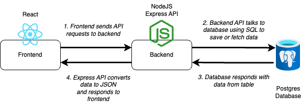

# ToDo List Project

In this project you are given a set of apps including a frontend, backend, and for the first time a database!

Your task as a cloud engineer is to get the applications all working happily together 🎉

## Architecture



The architecture above shows how the applications interact

### Frontend

The frontend is a React application.

It makes API calls to a backend API to save todo items and to read them back from the database.

### Backend 

The backend is a Node ExpressJS API 

It accepts: 

* GET request to read todo items
* POST request to add new todo items

It saves and reads todo items in a Postgres Database

### Database

There is also a database directory that contains a Dockerfile for spinning up a Postgres database

## Instructions

The target goal for this project is to have the three applications deployed into your local Kubernetes cluster, deployed via Argo and bonus points for having them as Helm charts.

The steps from this point will provide you with a guide for breaking the task down as you iterate towards the final solution.

### Running locally

Don't worry about Kubernetes or deployment just yet.

Before trying to deploy things, you should get the applications running locally via Docker. This helps you to understand "what good looks like" before deploying things

To do this we've shared a handy new tool called [Docker Compose](https://docs.docker.com/compose/)

Docker compose allows you to define a file that will spin up multiple containers.

You can see the Docker compose definition in the [docker-compose.yml](./docker-compose.yml) file

To spin up all 3 applications, whilst in the root of this repository (where the docker-compose file is) run:

```
docker compose up --build
```

You should then be able to open up the frontend by going to [localhost:8080](http://localhost:8080) but the API doesn't seem to be fetching items from the database. Seems like you might have to fix the end point - have a look through the code, debug on the browser and see if you can fix it it 💪🏽

### Container registry

Once you are happy with having the applications run locally, next its time to push those docker images to container registry.

You will need to:

* Build a docker image for your frontend, backend and database
* Set up a public container registry for the frontend
* Set up a public container registry for the backend
* Set up a public container registry for your database

Once the registries are in place you'll need to push your 3 docker images (frontend, backend and database ) to your registry.

**BONUS POINTS:** If you do this via a CircleCI pipeline. Challenge here is that this repo contains multiple applications so is considered to be a "mono-repo" which makes it harder to setup things in CircleCI so maybe come back to this one if you have time.

### Deploy the database to your local Kubernetes cluster


You will need to configure these apps on a local cluster using Helm and ArgoCD.

You should only have 1 container for the database to ensure that all of front end containers receive the same data and look the same to all of your customers.
